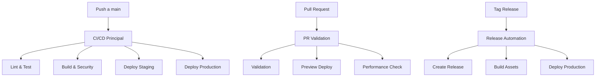

# 🔧 Configuración de CI/CD - Gastos Hormigas

Esta documentación explica cómo configurar y usar el sistema de CI/CD automático para el proyecto Gastos Hormigas.

## 📋 Tabla de Contenidos

- [🔧 Configuración de CI/CD - Gastos Hormigas](#-configuración-de-cicd---gastos-hormigas)
  - [📋 Tabla de Contenidos](#-tabla-de-contenidos)
  - [🏗️ Arquitectura del CI/CD](#️-arquitectura-del-cicd)
  - [🔐 Secrets Requeridos](#-secrets-requeridos)
  - [📊 Workflows Disponibles](#-workflows-disponibles)
  - [🚀 Configuración Inicial](#-configuración-inicial)
  - [🔄 Flujo de Desarrollo](#-flujo-de-desarrollo)
  - [📱 Deploy Automático](#-deploy-automático)
  - [🛠️ Mantenimiento](#️-mantenimiento)

## 🏗️ Arquitectura del CI/CD

Nuestro sistema de CI/CD está compuesto por 3 workflows principales:



## 🔐 Secrets Requeridos

Para que los workflows funcionen correctamente, debes configurar estos secrets en tu repositorio de GitHub:

### Firebase Secrets

```bash
# Configuración de Firebase
FIREBASE_SERVICE_ACCOUNT_PRODUCTION    # Service Account para producción
FIREBASE_SERVICE_ACCOUNT_STAGING       # Service Account para staging

# Variables de entorno de Firebase
VITE_FIREBASE_API_KEY                  # API Key de Firebase
VITE_FIREBASE_AUTH_DOMAIN             # Dominio de autenticación
VITE_FIREBASE_PROJECT_ID               # ID del proyecto
VITE_FIREBASE_STORAGE_BUCKET           # Bucket de storage
VITE_FIREBASE_MESSAGING_SENDER_ID      # Sender ID de messaging
VITE_FIREBASE_APP_ID                   # App ID de Firebase
```

### Servicios Externos

```bash
# Codecov para coverage
CODECOV_TOKEN                          # Token de Codecov

# Lighthouse CI
LHCI_GITHUB_APP_TOKEN                 # Token para Lighthouse CI

# Slack/Discord (opcional)
SLACK_WEBHOOK_URL                      # URL de webhook de Slack
DISCORD_WEBHOOK_URL                    # URL de webhook de Discord
```

### 🔧 Cómo configurar secrets

1. Ve a tu repositorio en GitHub
2. Settings → Secrets and variables → Actions
3. Click en "New repository secret"
4. Agrega cada secret con su valor correspondiente

## 📊 Workflows Disponibles

### 1. **CI/CD Principal** (`ci-cd.yml`)

**Trigger**: Push a `main` o `develop`

**Jobs**:
- 🔍 **Lint & Analyze**: ESLint, TypeScript check, análisis de código
- 🧪 **Test**: Tests unitarios e integración con coverage
- 🏗️ **Build**: Build de producción con optimizaciones
- 🔐 **Security**: Auditoria de dependencias y vulnerabilidades
- 📊 **Lighthouse**: Análisis de performance web
- 🚀 **Deploy Staging**: Deploy automático a staging
- 🌐 **Deploy Production**: Deploy a producción (solo main)
- 📢 **Notifications**: Notificaciones de resultado

### 2. **PR Validation** (`pr-validation.yml`)

**Trigger**: Pull Request a `main` o `develop`

**Jobs**:
- ✅ **Validation**: Lint, tests, build validation
- 🔍 **Preview Build**: Build para preview
- 🌐 **Deploy Preview**: Deploy temporal de preview
- 📊 **Analyze Changes**: Análisis de cambios y impacto
- 🧹 **Cleanup**: Limpieza de previews antiguos

### 3. **Release Automation** (`release.yml`)

**Trigger**: 
- Tag `v*.*.*`
- Manual dispatch

**Jobs**:
- 🏷️ **Create Release**: Genera release notes automáticas
- 🏗️ **Build Release**: Build optimizado de producción
- 🚀 **Deploy Release**: Deploy a producción
- 📢 **Notify Release**: Notificaciones de release

## 🚀 Configuración Inicial

### 1. Configurar Firebase Projects

```bash
# Instalar Firebase CLI
npm install -g firebase-tools

# Login a Firebase
firebase login

# Crear proyecto de staging
firebase projects:create gastos-hormigas-staging

# Crear proyecto de producción  
firebase projects:create gastos-hormigas-prod

# Configurar hosting
firebase init hosting
```

### 2. Generar Service Accounts

```bash
# Para producción
firebase service-accounts:generate firebase-adminsdk.json \
  --project gastos-hormigas-prod

# Para staging
firebase service-accounts:generate firebase-adminsdk-staging.json \
  --project gastos-hormigas-staging
```

### 3. Configurar Codecov

1. Ve a [codecov.io](https://codecov.io)
2. Conecta tu repositorio
3. Copia el token de upload
4. Agrégalo como secret `CODECOV_TOKEN`

### 4. Configurar Lighthouse CI

```bash
# Instalar LHCI
npm install -g @lhci/cli

# Configurar wizard
lhci wizard
```

## 🔄 Flujo de Desarrollo

### Desarrollo Normal

```bash
# 1. Crear feature branch
git checkout -b feature/nueva-funcionalidad

# 2. Hacer cambios y commits
git add .
git commit -m "feat: nueva funcionalidad increíble"

# 3. Push del branch
git push origin feature/nueva-funcionalidad

# 4. Crear Pull Request
# → Se ejecuta PR Validation automáticamente
# → Se crea preview deployment

# 5. Merge a develop
# → Se ejecuta CI/CD a staging

# 6. Merge a main  
# → Se ejecuta CI/CD a producción
```

### Release Process

```bash
# 1. Crear tag de release
git tag v1.2.3
git push origin v1.2.3

# → Se ejecuta Release Automation
# → Se crea GitHub Release
# → Se deploya a producción
```

### Manual Release

1. Ve a GitHub Actions
2. Selecciona "Release Automation"
3. Click "Run workflow"
4. Especifica versión y tipo de release

## 📱 Deploy Automático

### Staging Environment

- **URL**: `https://gastos-hormigas-staging.web.app`
- **Trigger**: Push a `develop`
- **Purpose**: Testing y QA

### Production Environment  

- **URL**: `https://gestos-gastosv2.web.app`
- **Trigger**: Push a `main` o Release
- **Purpose**: Aplicación final para usuarios

### Preview Deployments

- **URL**: `https://gastos-hormigas-pr-{number}.web.app`
- **Trigger**: Pull Requests
- **Purpose**: Review de cambios
- **Cleanup**: Automático después de merge/close

## 🛠️ Mantenimiento

### Monitoreo

```bash
# Ver status de workflows
gh workflow list

# Ver runs recientes
gh run list

# Ver logs de un run específico
gh run view {run-id} --log
```

### Troubleshooting

**❌ Build falla**:
- Verificar que todas las dependencies estén en package.json
- Revisar errores de TypeScript
- Confirmar que tests pasen localmente

**❌ Deploy falla**:
- Verificar secrets de Firebase
- Confirmar permisos de Service Account
- Revisar configuración de firebase.json

**❌ Tests fallan**:
- Ejecutar tests localmente: `npm test`
- Verificar coverage mínimo
- Revisar archivos de test actualizados

### Actualización de Dependencies

```bash
# Verificar dependencies obsoletas
npm outdated

# Actualizar dependencies
npm update

# Auditoría de seguridad
npm audit fix
```

### Optimización de Performance

1. **Lighthouse CI** reporta métricas automáticamente
2. **Bundle Analysis** en cada build
3. **Performance Budget** configurado
4. **Alertas automáticas** si performance baja

---

## 📚 Recursos Adicionales

- [GitHub Actions Documentation](https://docs.github.com/en/actions)
- [Firebase Hosting Guide](https://firebase.google.com/docs/hosting)
- [Lighthouse CI Setup](https://github.com/GoogleChrome/lighthouse-ci)
- [Codecov Documentation](https://docs.codecov.com/)

---

**🎉 ¡Tu CI/CD está listo! Ahora tienes un sistema de despliegue automático de nivel empresarial.**
