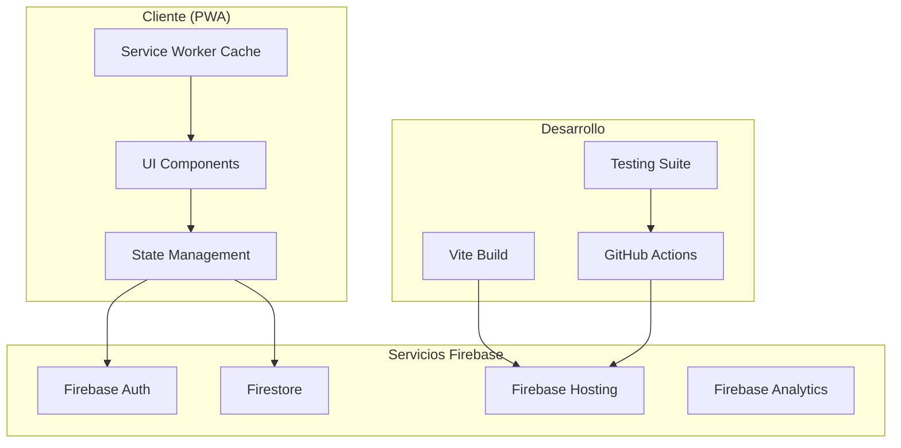

# 🏗️ Arquitectura de Gastos Hormigas

## 📋 Índice

- [1. Visión General](#1-visión-general)
- [2. Arquitectura de Alto Nivel](#2-arquitectura-de-alto-nivel)
- [3. Estructura del Frontend](#3-estructura-del-frontend)
- [4. Backend y Servicios](#4-backend-y-servicios)
- [5. Gestión de Estado](#5-gestión-de-estado)
- [6. Seguridad y Autenticación](#6-seguridad-y-autenticación)
- [7. PWA y Performance](#7-pwa-y-performance)
- [8. Testing y Calidad](#8-testing-y-calidad)
- [9. Deployment y CI/CD](#9-deployment-y-cicd)

## 1. Visión General

Gastos Hormigas está construida como una **Progressive Web App (PWA)** moderna que utiliza una arquitectura de **Single Page Application (SPA)** con React 19, TypeScript y Firebase como backend-as-a-service.

### 🎯 Principios Arquitectónicos

- **Modularidad**: Componentes independientes y reutilizables
- **Escalabilidad**: Estructura preparada para crecimiento
- **Performance**: Optimizaciones de carga y runtime
- **Seguridad**: Autenticación robusta y validación estricta
- **Offline-First**: Funcionalidad sin conexión
- **Responsive**: Adaptable a cualquier dispositivo

## 2. Arquitectura de Alto Nivel



### 🔄 Flujo de Datos

1. **UI Components** → Dispatch de acciones
2. **Custom Hooks** → Lógica de negocio
3. **React Context** → Estado global
4. **Services Layer** → Comunicación con Firebase
5. **Firebase** → Persistencia y autenticación
- **TypeScript**: Tipado estático para prevenir errores
- **Consistencia**: Patrones de código estandarizados
- **Testing**: Cobertura de tests unitarios e integración
- **Documentación**: Código autodocumentado

## 🏛️ Arquitectura de Alto Nivel

```
┌─────────────────────────────────────────────────────────┐
│                    Browser Layer                        │
├─────────────────────────────────────────────────────────┤
│  ┌─────────────┐  ┌─────────────┐  ┌─────────────┐     │
│  │   React     │  │    Vite     │  │   Service   │     │
│  │  Frontend   │  │ Dev Server  │  │   Worker    │     │
│  │             │  │             │  │  (Future)   │     │
│  └─────────────┘  └─────────────┘  └─────────────┘     │
└─────────────────────────────────────────────────────────┘
                              │
                              ▼
┌─────────────────────────────────────────────────────────┐
│                   Network Layer                         │
├─────────────────────────────────────────────────────────┤
│  ┌─────────────┐  ┌─────────────┐  ┌─────────────┐     │
│  │   HTTPS/    │  │  Firebase   │  │    CDN      │     │
│  │   TLS 1.3   │  │   SDK/API   │  │  (Static)   │     │
│  │             │  │             │  │             │     │
│  └─────────────┘  └─────────────┘  └─────────────┘     │
└─────────────────────────────────────────────────────────┘
                              │
                              ▼
┌─────────────────────────────────────────────────────────┐
│                   Backend Layer                         │
├─────────────────────────────────────────────────────────┤
│  ┌─────────────┐  ┌─────────────┐  ┌─────────────┐     │
│  │  Firebase   │  │  Firestore  │  │  Firebase   │     │
│  │    Auth     │  │  Database   │  │  Hosting    │     │
│  │             │  │             │  │             │     │
│  └─────────────┘  └─────────────┘  └─────────────┘     │
└─────────────────────────────────────────────────────────┘
```

## 🔄 Flujo de Datos

### **Unidirectional Data Flow**

```
┌─────────────┐     ┌─────────────┐     ┌─────────────┐
│   User      │────▶│ Component   │────▶│   Action    │
│ Interaction │     │   Event     │     │ Dispatcher  │
└─────────────┘     └─────────────┘     └─────────────┘
                                                 │
                                                 ▼
┌─────────────┐     ┌─────────────┐     ┌─────────────┐
│   UI        │◀────│   State     │◀────│  Service    │
│  Update     │     │   Update    │     │   Layer     │
└─────────────┘     └─────────────┘     └─────────────┘
                                                 │
                                                 ▼
                                       ┌─────────────┐
                                       │  Firebase   │
                                       │  Firestore  │
                                       └─────────────┘
```

## 🧩 Arquitectura de Componentes

### **Component Hierarchy**

```
App.tsx
├── Router
│   ├── AuthProvider
│   │   ├── ExpensesProvider
│   │   ├── FinancialsProvider
│   │   └── NotificationsProvider
│   └── Routes
│       ├── Layout
│       │   ├── Header
│       │   ├── Navigation
│       │   └── Footer
│       ├── DashboardPage
│       │   ├── Summary
│       │   ├── ExpenseChart
│       │   └── BudgetProgressBar
│       ├── RegistroPage
│       │   ├── ExpenseForm
│       │   ├── ExpenseList
│       │   └── ExpenseFilter
│       └── PlanningPage
│           ├── SavingsGoals
│           ├── NetWorthManager
│           └── DebtManager
```

### **Component Pattern: Container/Presenter**

```typescript
// Container Component (Smart)
export const ExpenseListContainer: React.FC = () => {
  const { expenses, loading, deleteExpense } = useExpenses();
  const { categories } = useCategories();
  const [filters, setFilters] = useState<FilterState>(initialFilters);
  
  const filteredExpenses = useMemo(() => 
    applyFilters(expenses, filters), [expenses, filters]
  );
  
  return (
    <ExpenseListPresenter
      expenses={filteredExpenses}
      categories={categories}
      loading={loading}
      filters={filters}
      onFilterChange={setFilters}
      onDelete={deleteExpense}
    />
  );
};

// Presenter Component (Dumb)
interface ExpenseListPresenterProps {
  expenses: Expense[];
  categories: Category[];
  loading: boolean;
  filters: FilterState;
  onFilterChange: (filters: FilterState) => void;
  onDelete: (id: string) => void;
}

export const ExpenseListPresenter: React.FC<ExpenseListPresenterProps> = ({
  expenses,
  categories,
  loading,
  filters,
  onFilterChange,
  onDelete
}) => {
  if (loading) return <LoadingState />;
  
  return (
    <div className={styles.container}>
      <ExpenseFilter 
        filters={filters} 
        categories={categories}
        onChange={onFilterChange} 
      />
      <ExpenseList 
        expenses={expenses} 
        onDelete={onDelete} 
      />
    </div>
  );
};
```

## 🗄️ Arquitectura de Datos

### **Data Layer Architecture**

```
┌─────────────────────────────────────────────────────────┐
│                   UI Components                         │
├─────────────────────────────────────────────────────────┤
│                 Custom Hooks                            │
├─────────────────────────────────────────────────────────┤
│               Context Providers                         │
├─────────────────────────────────────────────────────────┤
│                 Service Layer                           │
├─────────────────────────────────────────────────────────┤
│              Firebase Firestore                        │
└─────────────────────────────────────────────────────────┘
```

### **Data Flow Patterns**

#### **1. Read Operations**
```typescript
// Hook consumes data from context
const { expenses, loading } = useExpenses();

// Context provides data from service
const ExpensesProvider = ({ children }) => {
  const [expenses, setExpenses] = useState([]);
  
  useEffect(() => {
    const unsubscribe = expenseService.subscribeToExpenses(
      userId, 
      setExpenses
    );
    return unsubscribe;
  }, [userId]);
};

// Service abstracts Firebase operations
class ExpenseService {
  subscribeToExpenses(userId: string, callback: (expenses: Expense[]) => void) {
    return onSnapshot(
      collection(db, 'users', userId, 'expenses'),
      (snapshot) => {
        const expenses = snapshot.docs.map(doc => ({
          id: doc.id,
          ...doc.data()
        }));
        callback(expenses);
      }
    );
  }
}
```

#### **2. Write Operations**
```typescript
// Component triggers action
const handleSubmit = async (data: ExpenseFormData) => {
  await addExpense(data);
};

// Context handles state updates
const addExpense = async (data: Partial<Expense>) => {
  setLoading(true);
  try {
    const result = await expenseService.create(userId, data);
    if (result.success) {
      // Optimistic update
      setExpenses(prev => [result.data, ...prev]);
    }
  } finally {
    setLoading(false);
  }
};

// Service performs Firebase operation
async create(userId: string, data: Partial<Expense>) {
  const docRef = await addDoc(
    collection(db, 'users', userId, 'expenses'),
    {
      ...data,
      createdAt: serverTimestamp()
    }
  );
  return { success: true, data: { id: docRef.id, ...data } };
}
```

## 🔐 Security Architecture

### **Authentication Flow**

```
┌─────────────┐     ┌─────────────┐     ┌─────────────┐
│   User      │────▶│   Login     │────▶│  Firebase   │
│  Attempts   │     │  Component  │     │    Auth     │
│   Login     │     │             │     │             │
└─────────────┘     └─────────────┘     └─────────────┘
                                                 │
                                                 ▼
┌─────────────┐     ┌─────────────┐     ┌─────────────┐
│    App      │◀────│    Auth     │◀────│   JWT       │
│  Renders    │     │  Context    │     │   Token     │
│   with      │     │  Updates    │     │ Generated   │
│   User      │     │             │     │             │
└─────────────┘     └─────────────┘     └─────────────┘
```

### **Authorization Patterns**

```typescript
// Route protection
const ProtectedRoute: React.FC<{ children: React.ReactNode }> = ({ children }) => {
  const { user, loading } = useAuth();
  
  if (loading) return <LoadingState />;
  if (!user) return <Navigate to="/login" />;
  
  return <>{children}</>;
};

// Data access control
const useUserData = (collection: string) => {
  const { user } = useAuth();
  
  return useFirestoreCollection(
    user ? collection(db, 'users', user.uid, collection) : null
  );
};
```

### **Data Validation Layers**

```typescript
// 1. Frontend validation with Zod
const expenseSchema = z.object({
  amount: z.number().positive('Amount must be positive'),
  description: z.string().min(1, 'Description is required'),
  categoryId: z.string().uuid('Invalid category ID')
});

// 2. Firestore security rules
// rules_version = '2';
// service cloud.firestore {
//   match /databases/{database}/documents {
//     match /users/{userId}/expenses/{expenseId} {
//       allow create: if request.auth != null 
//         && request.auth.uid == userId
//         && validateExpense(request.resource.data);
//     }
//   }
// }

// 3. Service layer validation
class ExpenseService {
  async create(userId: string, data: Partial<Expense>) {
    // Validate input
    const validated = expenseSchema.parse(data);
    
    // Sanitize data
    const sanitized = this.sanitizeExpenseData(validated);
    
    // Perform operation
    return this.performCreate(userId, sanitized);
  }
}
```

## 🎨 UI Architecture

### **Design System Structure**

```
src/
├── components/
│   ├── atoms/           # Basic building blocks
│   │   ├── Button/
│   │   ├── Input/
│   │   └── Icon/
│   ├── molecules/       # Simple component combinations
│   │   ├── FormField/
│   │   ├── Card/
│   │   └── Modal/
│   ├── organisms/       # Complex component combinations
│   │   ├── Header/
│   │   ├── ExpenseForm/
│   │   └── DataTable/
│   └── templates/       # Page-level layouts
│       ├── DashboardLayout/
│       └── AuthLayout/
└── pages/               # Specific page implementations
    ├── DashboardPage/
    └── LoginPage/
```

### **Theme Architecture**

```typescript
// Theme system with CSS custom properties
interface Theme {
  colors: {
    primary: string;
    secondary: string;
    background: string;
    surface: string;
    text: {
      primary: string;
      secondary: string;
    };
    status: {
      success: string;
      warning: string;
      error: string;
      info: string;
    };
  };
  spacing: {
    xs: string;
    sm: string;
    md: string;
    lg: string;
    xl: string;
  };
  breakpoints: {
    mobile: string;
    tablet: string;
    desktop: string;
  };
}

// Theme provider
export const ThemeProvider: React.FC<{ children: React.ReactNode }> = ({ children }) => {
  const [theme, setTheme] = useState<'light' | 'dark'>('light');
  
  useEffect(() => {
    document.documentElement.setAttribute('data-theme', theme);
  }, [theme]);
  
  return (
    <ThemeContext.Provider value={{ theme, setTheme }}>
      {children}
    </ThemeContext.Provider>
  );
};
```

## 📱 Responsive Architecture

### **Breakpoint Strategy**

```css
/* Mobile First Approach */
.component {
  /* Mobile styles (320px+) */
  padding: 1rem;
  font-size: 14px;
}

@media (min-width: 768px) {
  /* Tablet styles */
  .component {
    padding: 1.5rem;
    font-size: 16px;
  }
}

@media (min-width: 1024px) {
  /* Desktop styles */
  .component {
    padding: 2rem;
    font-size: 18px;
  }
}
```

### **Adaptive Components**

```typescript
// Hook for responsive behavior
const useResponsive = () => {
  const [breakpoint, setBreakpoint] = useState<'mobile' | 'tablet' | 'desktop'>('mobile');
  
  useEffect(() => {
    const updateBreakpoint = () => {
      const width = window.innerWidth;
      if (width >= 1024) setBreakpoint('desktop');
      else if (width >= 768) setBreakpoint('tablet');
      else setBreakpoint('mobile');
    };
    
    updateBreakpoint();
    window.addEventListener('resize', updateBreakpoint);
    return () => window.removeEventListener('resize', updateBreakpoint);
  }, []);
  
  return breakpoint;
};

// Adaptive component
const ExpenseList: React.FC = () => {
  const breakpoint = useResponsive();
  
  return (
    <div className={styles.container}>
      {breakpoint === 'mobile' ? (
        <MobileExpenseList />
      ) : (
        <DesktopExpenseList />
      )}
    </div>
  );
};
```

## ⚡ Performance Architecture

### **Bundle Optimization Strategy**

```typescript
// Dynamic imports for code splitting
const LazyDashboard = lazy(() => 
  import('./pages/DashboardPage').then(module => ({
    default: module.DashboardPage
  }))
);

// Preloading critical resources
const preloadDashboard = () => {
  import('./pages/DashboardPage');
};

// Service Worker caching strategy
self.addEventListener('fetch', (event) => {
  if (event.request.url.includes('/api/')) {
    // Network first for API calls
    event.respondWith(networkFirst(event.request));
  } else {
    // Cache first for static assets
    event.respondWith(cacheFirst(event.request));
  }
});
```

### **State Management Optimization**

```typescript
// Memoization patterns
const ExpensiveComponent: React.FC<Props> = memo(({ data, onUpdate }) => {
  const processedData = useMemo(() => 
    expensiveCalculation(data), [data]
  );
  
  const debouncedUpdate = useMemo(() => 
    debounce(onUpdate, 300), [onUpdate]
  );
  
  return <div>{processedData}</div>;
});

// Context optimization
const ExpensesProvider: React.FC = ({ children }) => {
  const [expenses, setExpenses] = useState<Expense[]>([]);
  
  // Separate frequently changing state
  const contextValue = useMemo(() => ({
    expenses,
    addExpense: (expense: Expense) => setExpenses(prev => [...prev, expense])
  }), [expenses]);
  
  return (
    <ExpensesContext.Provider value={contextValue}>
      {children}
    </ExpensesContext.Provider>
  );
};
```

## 🔄 State Management Architecture

### **State Distribution Strategy**

```
Global State (Context)
├── Auth State
│   ├── User Info
│   ├── Auth Status
│   └── Permissions
├── App State
│   ├── Theme
│   ├── Notifications
│   └── UI State
└── Domain State
    ├── Expenses
    ├── Categories
    ├── Budget
    └── Goals

Local State (useState)
├── Form State
├── Modal State
├── Loading States
└── Temporary UI State

Server State (Firebase)
├── Real-time Subscriptions
├── Cached Queries
└── Optimistic Updates
```

### **Context Architecture**

```typescript
// Root provider composition
export const AppProviders: React.FC<{ children: React.ReactNode }> = ({ children }) => {
  return (
    <ErrorBoundary>
      <ThemeProvider>
        <AuthProvider>
          <NotificationsProvider>
            <ExpensesProvider>
              <FinancialsProvider>
                {children}
              </FinancialsProvider>
            </ExpensesProvider>
          </NotificationsProvider>
        </AuthProvider>
      </ThemeProvider>
    </ErrorBoundary>
  );
};

// Context with reducer pattern for complex state
const financialsReducer = (state: FinancialsState, action: FinancialsAction) => {
  switch (action.type) {
    case 'SET_BUDGET':
      return {
        ...state,
        budgets: {
          ...state.budgets,
          [action.categoryId]: action.amount
        }
      };
    case 'ADD_SAVINGS_GOAL':
      return {
        ...state,
        savingsGoals: [...state.savingsGoals, action.goal]
      };
    default:
      return state;
  }
};
```

## 📊 Error Handling Architecture

### **Error Boundary Strategy**

```typescript
// Global error boundary
class AppErrorBoundary extends Component<Props, State> {
  constructor(props: Props) {
    super(props);
    this.state = { hasError: false, error: null };
  }
  
  static getDerivedStateFromError(error: Error): State {
    return { hasError: true, error };
  }
  
  componentDidCatch(error: Error, errorInfo: ErrorInfo) {
    // Log error to monitoring service
    trackError(error, errorInfo);
  }
  
  render() {
    if (this.state.hasError) {
      return <ErrorFallback error={this.state.error} />;
    }
    
    return this.props.children;
  }
}

// Service-level error handling
class ServiceError extends Error {
  constructor(
    public code: string,
    message: string,
    public details?: any
  ) {
    super(message);
    this.name = 'ServiceError';
  }
}

// Async error handling with Result pattern
type ServiceResult<T> = 
  | { success: true; data: T }
  | { success: false; error: string; code?: string };

async function safeServiceCall<T>(
  operation: () => Promise<T>
): Promise<ServiceResult<T>> {
  try {
    const data = await operation();
    return { success: true, data };
  } catch (error) {
    if (error instanceof ServiceError) {
      return { 
        success: false, 
        error: error.message, 
        code: error.code 
      };
    }
    return { 
      success: false, 
      error: 'An unexpected error occurred' 
    };
  }
}
```

## 🚀 Deployment Architecture

### **Build & Deploy Pipeline**

```
┌─────────────┐     ┌─────────────┐     ┌─────────────┐
│  Developer  │────▶│    Git      │────▶│   GitHub    │
│   Commits   │     │    Push     │     │   Actions   │
└─────────────┘     └─────────────┘     └─────────────┘
                                                 │
                                                 ▼
┌─────────────┐     ┌─────────────┐     ┌─────────────┐
│  Firebase   │◀────│    Build    │◀────│    Test     │
│   Hosting   │     │   & Deploy  │     │   & Lint    │
└─────────────┘     └─────────────┘     └─────────────┘
```

### **Environment Strategy**

```typescript
// Environment-specific configurations
const environments = {
  development: {
    firebase: developmentFirebaseConfig,
    apiEndpoints: developmentEndpoints,
    features: {
      debugMode: true,
      analyticsEnabled: false
    }
  },
  production: {
    firebase: productionFirebaseConfig,
    apiEndpoints: productionEndpoints,
    features: {
      debugMode: false,
      analyticsEnabled: true
    }
  }
};

export const config = environments[import.meta.env.MODE as keyof typeof environments];
```

## 📈 Monitoring Architecture

### **Observability Strategy**

```typescript
// Performance monitoring
const performanceMonitor = {
  // Core Web Vitals
  measureCLS: (callback: (value: number) => void) => {
    new PerformanceObserver((list) => {
      for (const entry of list.getEntries()) {
        if (entry.entryType === 'layout-shift' && !entry.hadRecentInput) {
          callback(entry.value);
        }
      }
    }).observe({ entryTypes: ['layout-shift'] });
  },
  
  // Custom metrics
  measureComponentRender: (componentName: string, renderTime: number) => {
    trackUserAction('component_render', {
      component: componentName,
      render_time: renderTime
    });
  }
};

// Error tracking
const errorTracker = {
  captureError: (error: Error, context?: Record<string, any>) => {
    console.error('Error captured:', error);
    
    if (config.app.environment === 'production') {
      // Send to monitoring service
      logEvent(analytics, 'exception', {
        description: error.message,
        fatal: false,
        context: JSON.stringify(context)
      });
    }
  }
};
```

---

*Esta arquitectura está diseñada para escalar y evolucionar con los requerimientos del negocio, manteniendo la calidad del código y la experiencia del usuario.*
