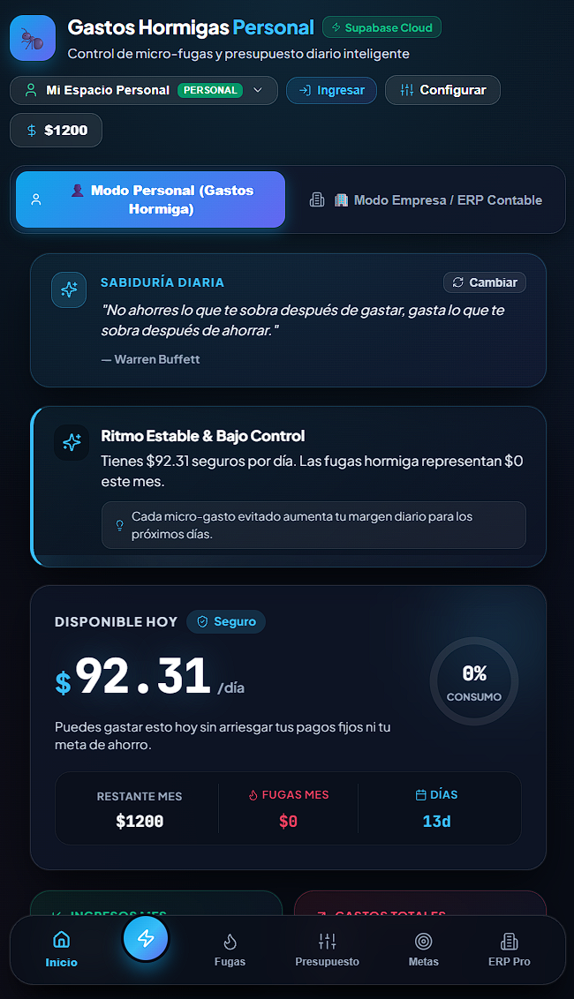
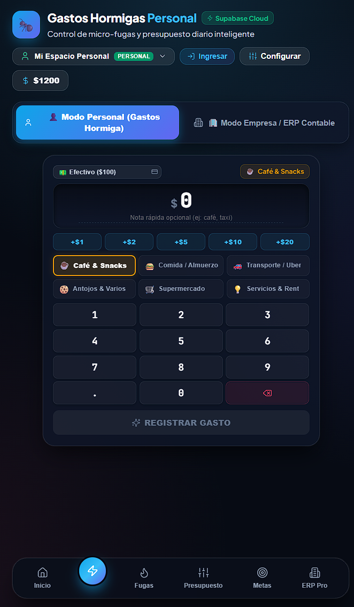
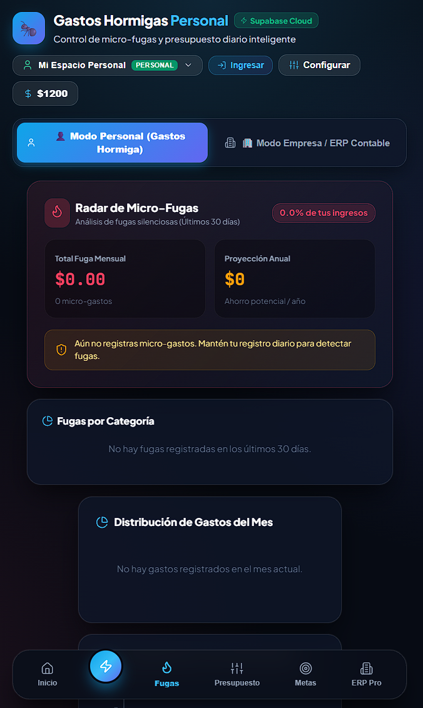
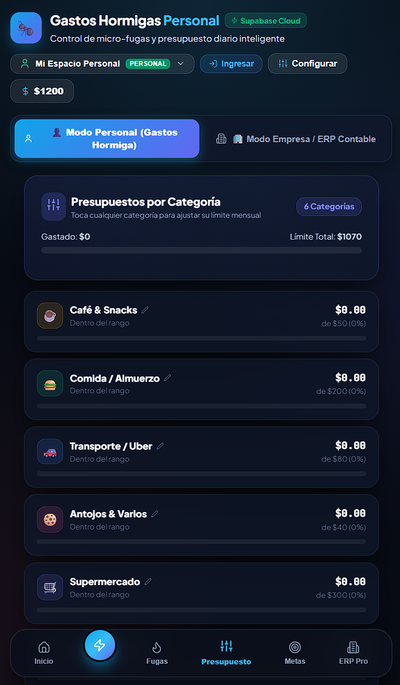
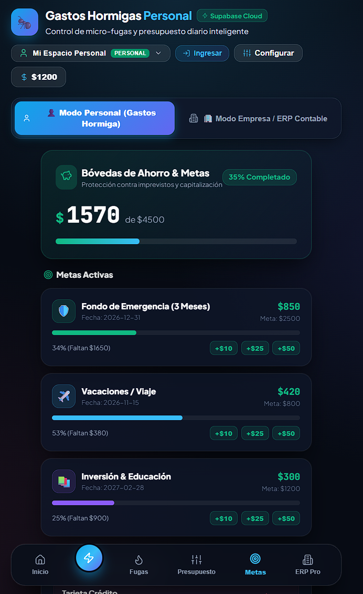
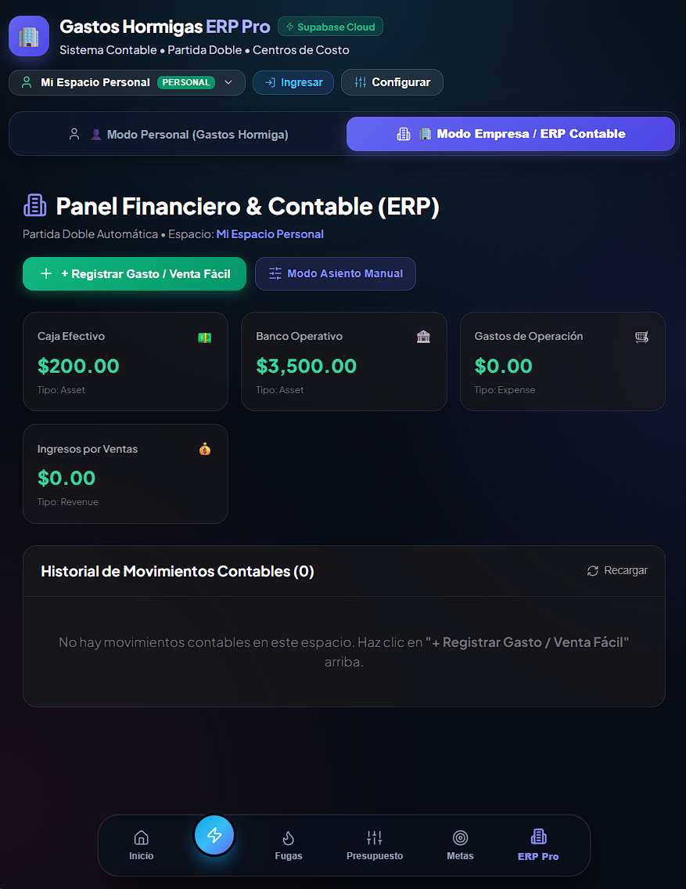

# 🐜 Gastos Hormigas & Micro-ERP SaaS

> **Plataforma Dual de Finanzas Personales y Contabilidad Empresarial con Partida Doble.**  
> Diseñada para erradicar micro-fugas de dinero en <1 segundo y gestionar la contabilidad de microempresas con rigor profesional.

---

## 🌐 Enlaces del Proyecto

- **Repositorio GitHub:** [https://github.com/LuzuJ/Gastos_Hormigas.git](https://github.com/LuzuJ/Gastos_Hormigas.git)
- **Despliegue Web (PWA):** [https://gestos-gastosv2.web.app](https://gestos-gastosv2.web.app)
- **Stack:** React 19 • TypeScript • Vite • Supabase (PostgreSQL RLS)

---

## 📸 Vista General y Funcionalidades en Detalle

### 1. 📊 Dashboard Principal y Safe-to-Spend Diario
El centro de control inteligente calcula en tiempo real tu **Disponible Diario Seguro (Safe-to-Spend)**, evitando que comprometas el pago de arriendos o metas de ahorro. Incluye consejos de sabiduría financiera, diagnósticos automáticos y resumen de ingresos/gastos mensuales.

<p align="center">
  
</p>

---

### 2. ⚡ Teclado Táctil Háptico de Captura Rápida (<1s)
Elimina la fricción de los formularios tradicionales. Permite registrar micro-gastos en menos de un segundo con presets automáticos (`+$1`, `+$2`, `+$5`, `+$10`, `+$20`), selección directa de categoría (Café, Comida, Transporte, Antojos) y cuenta de débito asociada.

<p align="center">
  
</p>

---

### 3. 🔥 Radar de Fugas Hormiga y Diagnóstico de Fugas
Identifica y cuantifica las pequeñas compras recurrentes que erosionan silenciosamente tu capital. Muestra estadísticas históricas, desglose porcentual por categorías e impacto proyectado a 30 días.

<p align="center">
  
</p>

---

### 4. 🎯 Gestor de Presupuestos por Categoría
Permite establecer límites mensuales por rubro de gasto con barras de progreso visuales y alertas proactivas antes de que se agote el margen disponible.

<p align="center">
  
</p>

---

### 5. 🏦 Bóvedas de Ahorro y Patrimonio
Sistema de ahorro programado con depósitos directos desde tus cuentas activas. Protege el dinero destinado a fondos de emergencia, inversiones o metas a mediano y largo plazo.

<p align="center">
  
</p>

---

### 6. 🏢 Modo Empresa: Micro-ERP Contable con Partida Doble
Diseñado para pequeños negocios, freelancers y startups. Incorpora un **Libro Diario (General Ledger)** tabular con cumplimiento estricto de partida doble ($\sum \text{Débitos} = \sum \text{Créditos}$), plan de cuentas contables, centros de costo y directorio de proveedores/clientes.

<p align="center">
  
</p>

---

## 🏛️ Arquitectura Dual-Core

```
                       ┌──────────────────────────────────────────────┐
                       │           Gastos Hormigas SaaS Platform      │
                       └──────────────────────┬───────────────────────┘
                                              │
                    ┌─────────────────────────┴─────────────────────────┐
                    ▼                                                   ▼
       ┌──────────────────────────┐                        ┌──────────────────────────┐
       │   👤 MODO PERSONAL       │                        │   🏢 MODO EMPRESA / ERP  │
       ├──────────────────────────┤                        ├──────────────────────────┤
       │ • Teclado Táctil <1s     │                        │ • Partida Doble Real     │
       │ • Radar de Fugas Hormiga │                        │ • Libro Diario Tabular   │
       │ • Safe-to-Spend Diario   │                        │ • Plan de Cuentas        │
       │ • Bóvedas de Ahorro      │                        │ • Centros de Costo       │
       │ • Presupuestos por Cat.  │                        │ • Terceros / Proveedores │
       └──────────────────────────┘                        └──────────────────────────┘
                    │                                                   │
                    └─────────────────────────┬─────────────────────────┘
                                              ▼
                       ┌──────────────────────────────────────────────┐
                       │    Motor de Persistencia Híbrida             │
                       │    • LocalStorage / Offline Cache (0ms)      │
                       │    • Supabase PostgreSQL + RLS + RPC         │
                       └──────────────────────────────────────────────┘
```

---

## 🛠️ Stack Tecnológico

| Capa | Tecnologías |
| :--- | :--- |
| **Frontend Core** | React 19, TypeScript, Vite |
| **Diseño & UI** | Vanilla CSS Glassmorphism, CSS Variables, Lucide Icons, Plus Jakarta Sans & JetBrains Mono |
| **Base de Datos** | PostgreSQL (Supabase) con 11 tablas relacionales y esquemas tipados |
| **Seguridad** | Supabase Auth (OAuth Google, Email/Password), Row Level Security (RLS) multi-inquilino |
| **Lógica Backend** | Procedimientos almacenados PL/pgSQL (`RPC record_simple_entry`) para transacciones atómicas |
| **Resiliencia** | Arquitectura *Offline-First* con fallback automático a `localStorage` |

---

## 🔒 Esquema de Base de Datos y Seguridad (Supabase)

La base de datos relacional implementa aislamiento estricto por usuario y espacio de trabajo:

```sql
profiles                  --> Perfiles de usuario y configuración de moneda
workspaces                --> Espacios de trabajo (Personal o Business)
workspace_members         --> Control de acceso y roles (Owner, Admin, Member)
accounts                  --> Cuentas financieras (Activo, Pasivo, Patrimonio)
categories                --> Categorías de ingresos, gastos y costos
cost_centers              --> Centros de costo empresariales
contacts                  --> Directorio de clientes y proveedores
journal_entries           --> Encabezados de asientos contables
journal_entry_lines       --> Líneas de detalle de partida doble (debit / credit)
recurring_rules           --> Automatización de gastos e ingresos recurrentes
savings_vaults            --> Bóvedas de ahorro y metas
```

---

## 🚀 Guía de Instalación y Desarrollo Local

### Requisitos Previos
- **Node.js** (versión 18 o superior)
- **npm** o **pnpm**

### 1. Clonar el Repositorio
```bash
git clone https://github.com/LuzuJ/Gastos_Hormigas.git
cd Gastos_Hormigas
```

### 2. Instalar Dependencias
```bash
npm install
```

### 3. Variables de Entorno
Crea un archivo `.env` en la raíz del proyecto con tus credenciales de Supabase:
```env
VITE_SUPABASE_URL=https://tu-proyecto.supabase.co
VITE_SUPABASE_ANON_KEY=tu-anon-key-de-supabase
```

### 4. Ejecutar Servidor de Desarrollo
```bash
npm run dev
```
Abre tu navegador en `http://localhost:5173/`.

### 5. Compilar para Producción
```bash
npm run build
```

---

## 📄 Licencia

Este proyecto está bajo la Licencia **MIT**. Consulta el archivo `LICENSE` para más detalles.

---

**Desarrollado por [LuzuJ](https://github.com/LuzuJ)**
